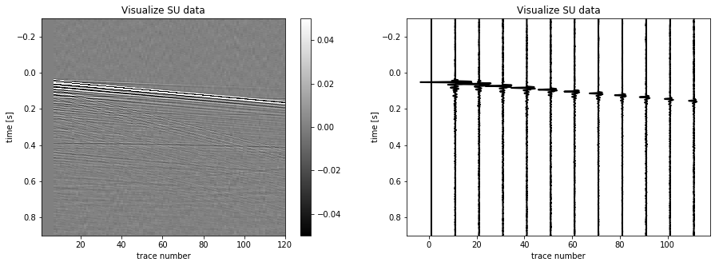

Read, write and create SU data
==============================

The SU data format is a subset of the industrial standard SEG-Y. It
consists in a binary trace header containing useful informations on the
data such as: the number of time samples (ns), the time sampling (dt),
the source and receiver positions (sx, sy, gx and gy), the position of
the trace in the file and other fields to store metadata.

Read a SU file
--------------

.. code:: ipython3

    # Import the SUdata class from nessi.io module
    from nessi.io import suread

    # Read the SU file
    dobs = suread('data/musc_F50_01.su')

Access to metadata
------------------

The access to header is very simple since a valid keyword is provided.
Some header values, such as ``dt``, are not in second and a scaling
factor must be applied (please see Seismic Unix keyword documentation
for more informations). Header values can also be assessed using the
gethdr method.

.. code:: ipython3

    # Get number of time samples and time sampling directly from the header
    ns0 = dobs.header[0]['ns']
    dt0 = dobs.header[0]['dt']/1000000.
    # Get number of time samples and time sampling using gethdr method
    ns1 = dobs.gethdr(key='ns', imin=0, count=1)
    dt1 = dobs.gethdr(key='dt', imin=0, count=1)
    # Print results
    print('Direct from header ::', ns0, dt0)
    print('Using gethdr method', ns1, dt1)

.. parsed-literal::

    Direct from header :: 12000 0.0001
    Using gethdr method [12000] [1.e-04]

Header values can be directly modified, *i.e.* to modify the time
sampling for all the traces:

``dobs.header[:]['dt'] = new_value_in_seconds * 1000000.``

Visualize data
--------------

Since many useful informations are stored in the SU header, plotting
data is easy and the function's parameters are almost all related to the
output image layout.

.. code:: ipython3

    # Import matplotlib
    import matplotlib.pyplot as plt

    # Show data
    fig = plt.figure(figsize=(15,5))
    plt.subplot(121)
    dobs.image(clip=0.05, label2='trace number', label1='time [s]', title='Visualize SU data', legend=1)
    plt.subplot(122)
    plt.ylim(0.25, 0.)
    dobs.wiggle(label2='trace number', label1='time [s]', title='Visualize SU data', skip=10, xcur=2, tracecolor='black')
    plt.show()

Write SU file on disk
---------------------

.. code:: ipython3

    # Write a SU file
    dobs.write('output', path='data')

Create SU data
--------------

.. code:: ipython3

    # Import numpy module
    import numpy as np
    from nessi.core import Stream

    # Create fake data using numpy with the time-axis along axis 1
    ntrac_fake = 20
    ns_fake = 10000
    dt_fake = 0.0001
    data_fake = np.zeros((ntrac_fake, ns_fake))

    # Create a simple SU dataset with minimal informations (tracl, ns, dt) from a numpy array
    dobs_fake = Stream()
    dobs_fake.create(data_fake, dt=dt_fake)

    # Check header values and the number of traces
    print(dobs_fake.header[0]['ns'], dobs_fake.header[0]['dt']/1000000., np.size(dobs_fake.header, axis=0))

.. parsed-literal::

    10000 0.0001 20
